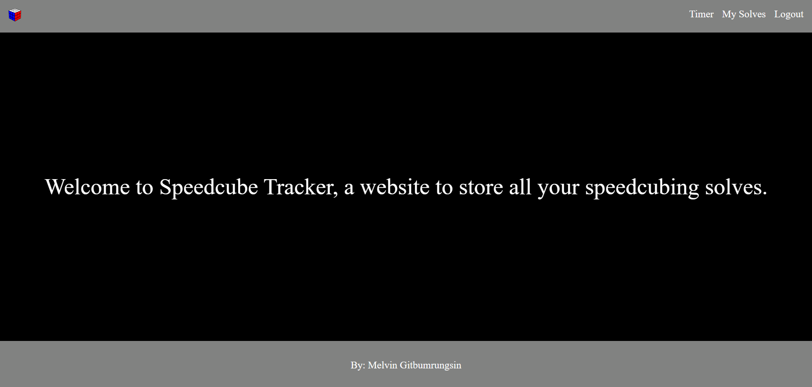
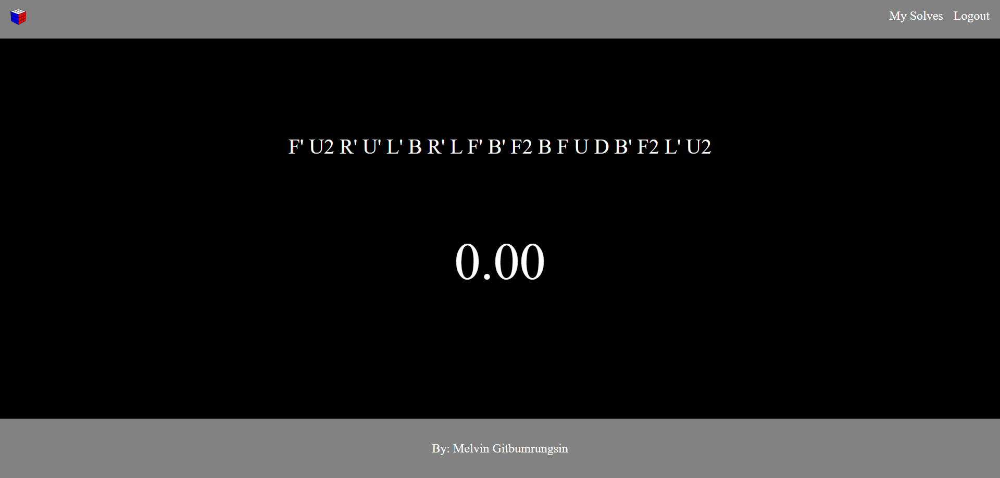
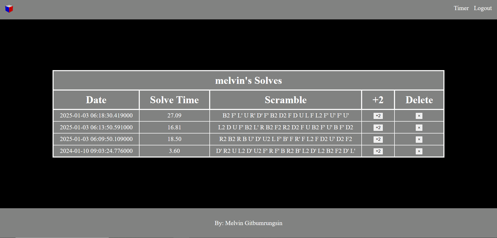

# Link to Deployed Website: https://speedcube-tracker-751965232584.herokuapp.com/

### Introduction
- A website designed for speedcubing hobbyists to track their puzzle solves and access them anywhere at anytime.

### How to Use
- Register an account and login.
- Timer Page: Apply the displayed scramble to your Rubik's Cube. Hold spacebar to ready the timer, and release to start the time. Once the timer has started, press spacebar again to stop the timer. The time, along with the scramble, gets saved to the "My Solves" page.
- My Solves Page: Use to view past solve times, the date of the solves (in UTC), and the scrambles. You can add +2 to your solve time in case of a DNF (Did not finish), or you can delete your past solves.

### Tools Used
- Python/Flask Backend
- HTML, CSS, JavaScript Frontend
- MongoDB Database
- Heroku Deployment Platform
- Git/GitHub Version Control

### Screenshots

